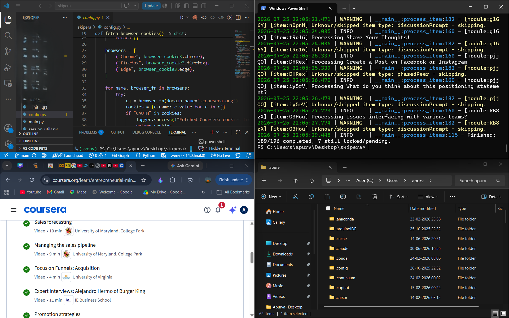
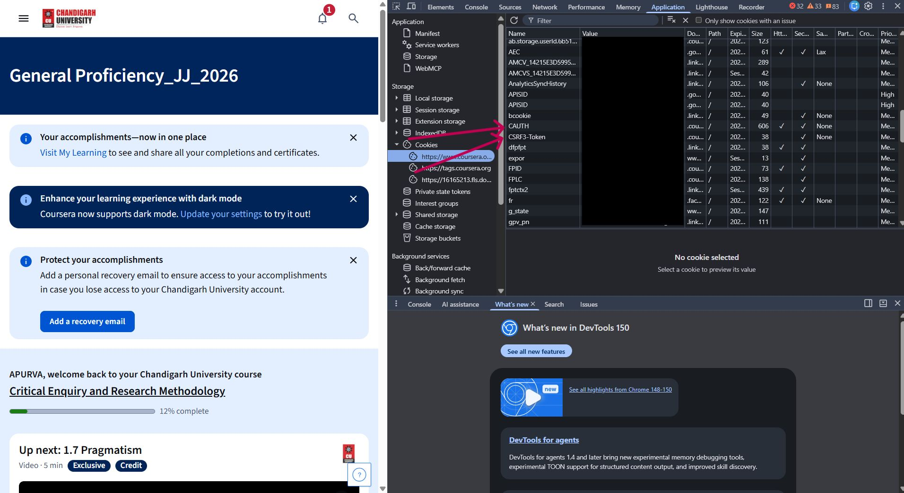

# Skip Course

> Skip Coursera course videos in minutes.
> This project was built purely as an educational exercise to learn about Python automation, authenticated web requests, and developer tooling. Users are responsible for complying with Coursera's Terms of Service and applicable policies.


<p align="center">
  
</p>

---

## 👨‍💻 Developer

### **Apurva Anand**

Full Stack Developer • Python • Machine Learning • Open Source Enthusiast

- GitHub: https://github.com/apurvaanand51
- Project: Skip Course
- Language: Python

---

## 📖 About

Skip Course is a lightweight Python automation tool that automatically marks Coursera course videos as completed.

Instead of manually opening every lecture and waiting for progress to update, this tool communicates with Coursera using your authenticated session and completes the process within a few minutes.

The project also includes a simple web utility that helps users generate the required configuration file and extract course slugs without editing JSON manually.

---

# ✨ Features

- Generate `config.json` automatically
- Extract Course Slug from any Coursera URL
- Lightweight Python CLI
- Simple HTML helper website
- No browser automation required
- Works using your Coursera session cookies
- Setup takes less than 5 minutes

---

# 📂 Project Structure

```
skip-course
│
├── apurva/
│   ├── main.py
│   ├── ...
│
├── web/
│   ├── index.html
│   ├── style.css
│   ├── main.js
│   ├── img.png
│   └── cookie.jpg
│
├── requirements.txt
└── README.md
```

---

# 🖥️ Website Utility

The repository contains a simple helper website.

It allows users to

- Generate config.json
- Copy JSON
- Download config.json
- Extract Course Slug
- Copy Course Slug
- Toggle Dark Mode

Website Preview

<p align="center">

</p>

---

# ⚙️ Local Setup

## 1. Clone Repository

```bash
git clone https://github.com/apurvaanand51/skip-course.git

cd skip-course
```

---

## 2. Install Python

Python is required.

Download it from

https://www.python.org/downloads/

or watch

https://www.youtube.com/watch?v=ddGTXBhaGWA

Verify installation

```bash
python --version
```

---

## 3. Install Dependencies

```bash
pip install -r requirements.txt
```

If the terminal appears stuck on

```
pyproject.toml
```

simply press

```
Ctrl + C
```

This is completely normal.

---

# 🌐 Using the Website

Open

[https://skip-course.netlify.app](https://skip-course.netlify.app)


in your browser.

The page guides you through the entire setup process.

---

# 🔐 Step 1 — Obtain Coursera Cookies

Login to your Coursera account.

Open Developer Tools

```
Right Click
↓

Inspect
↓

Application

↓

Cookies

↓

coursera.org
```

Copy

- CAUTH
- CSRF3-Token
- __204u

Example

<p align="center">

</p>

---

# 📝 Step 2 — Generate config.json

Paste

- CAUTH
- CSRF3-Token
- __204u

into the website.

Click

```
Generate JSON
```

You may

- Copy JSON
- Download config.json

---

# 📁 Step 3 — Create Configuration Folder

Create

```
C:\Users\<YOUR_USERNAME>\.skip-course
```

Place

```
config.json
```

inside that folder.

The structure should become

```
C:\Users\<USERNAME>

└── .skip-course
    └── config.json
```

---

# 🔗 Step 4 — Extract Course Slug

Paste any Coursera course URL.

Example

```
https://www.coursera.org/learn/machine-learning/home
```

Output

```
machine-learning
```

Copy the generated slug.

---

# ▶ Step 5 — Run the Tool

Inside the project directory

```bash
python -m apurva.main machine-learning
```

Replace

```
machine-learning
```

with your own course slug.

---

# ❗ Common Errors

## Module Not Found

Install the missing package

```bash
pip install package-name
```

Example

```bash
pip install click
```

---

## Invalid Cookies

Ensure you copied

- CAUTH
- CSRF3-Token
- __204u

from the same logged-in browser session.

---

## Invalid Course Slug

Only use the slug.

Correct

```
machine-learning
```

Incorrect

```
https://www.coursera.org/learn/machine-learning/home
```

---

# 💡 Example

```bash
python -m apurva.main python-data-analysis
```

---

# 🛠 Technologies Used

- Python
- Requests
- HTML
- CSS
- JavaScript

---

# 🤝 Contributing

Pull Requests are welcome.

Feel free to open an Issue for

- Bug Reports
- Feature Requests
- Improvements

---

# ⭐ Support

If this project helped you,

please consider giving the repository a ⭐ on GitHub.

It helps more people discover the project.

---

# ⚠ Disclaimer

This project is intended for educational and automation purposes.

Users are responsible for complying with Coursera's Terms of Service and using the software responsibly.


<p align="center">

Made with ❤️ by

# Apurva Anand

[LinkedIn](https://www.linkedin.com/in/apurva-anand-zeroone/)

</p>
